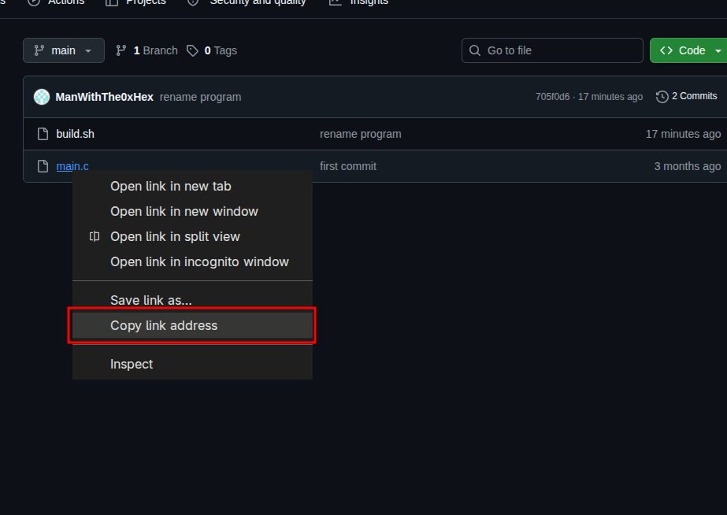
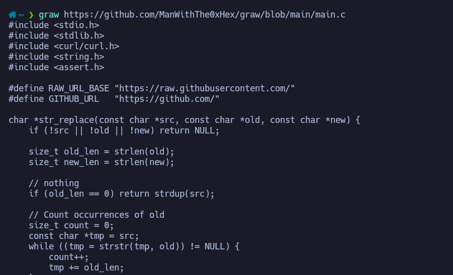

# graw 
graw is a lightweight CLI tool that allows you to download raw file directly from GitHub using standard repository URLs.

## Install
```shell
git clone https://github.com/ManWithThe0xHex/graw.git
cd graw
./build
sudo cp graw /usr/local/bin/
```

## Use
Copy url from a file using right click.


```shell
graw URL

# For save content
graw URL > filename.ext
```

